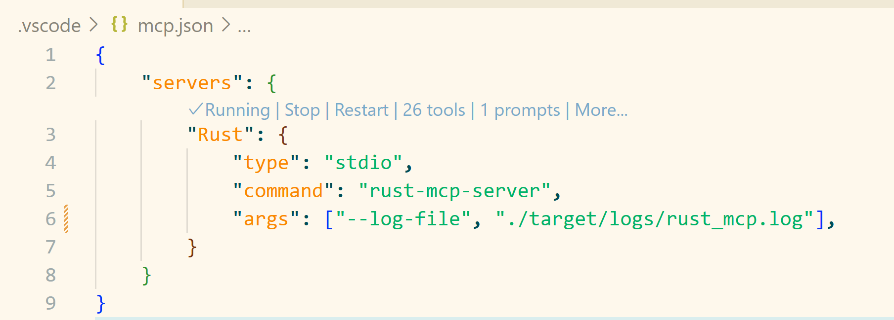

# Rust MCP Server

`rust-mcp-server` is a server that implements the [Model Context Protocol (MCP)](https://modelcontextprotocol.io/introduction). It acts as a bridge between a large language model (LLM) like GitHub Copilot and your local Rust development environment.

By exposing local tools and project context to the LLM, rust-mcp-server allows the model to perform actions on your behalf, such as building, testing, and analyzing your Rust code.

## Table of Contents

- [Why use `rust-mcp-server`?](#why-use-rust-mcp-server)
- [Features](#features)
  - [Core Cargo Commands](#core-cargo-commands)
  - [Project Management](#project-management)
  - [Dependency Management](#dependency-management)
  - [Code Quality & Security](#code-quality--security)
  - [Rust Toolchain Management](#rust-toolchain-management)
- [Command Line Arguments](#command-line-arguments)
- [Configuring with VS Code](#configuring-with-vs-code)
- [HTTP Mode](#http-mode)
- [GitHub Copilot Coding Agent Integration](#github-copilot-coding-agent-integration)

## Why use `rust-mcp-server`?

Integrating an LLM with your local development environment via rust-mcp-server can significantly enhance your productivity. The LLM can:

*   **Automate common tasks**: Run `cargo check`, `cargo build`, `cargo test`, and `cargo fmt` directly.
*   **Manage dependencies**: Add new dependencies with `cargo add`, find unused dependencies with `cargo-machete`
*   **Apply Rust best practices**: Use `cargo clippy` to lint your code and catch common mistakes, ensuring adherence to Rust guidelines. The LLM can also leverage other tools to help you write idiomatic and robust Rust code.

Essentially, it turns your AI assistant into an active participant in your development workflow, capable of executing commands and helping you manage your project.

## Features

rust-mcp-server exposes a comprehensive set of Rust development tools to the LLM:

### Core Cargo Commands
*   **`cargo-build`**: Compile your package
*   **`cargo-check`**: Analyze the current package and report errors, but don't build it
*   **`cargo-test`**: Run the tests
*   **`cargo-doc`**: Build documentation for your package (recommended with `--no-deps` and specific `--package` for faster builds)
*   **`cargo-fmt`**: Format the code according to the project's style
*   **`cargo-clippy`**: Check for common mistakes and improve code quality using Clippy
*   **`cargo-clean`**: Clean the target directory

### Project Management
*   **`cargo-new`**: Create a new cargo package
*   **`cargo-generate_lockfile`**: Generate or update the Cargo.lock file
*   **`cargo-package`**: Assemble the local package into a distributable tarball
*   **`cargo-list`**: List installed cargo commands

### Dependency Management
*   **`cargo-add`**: Add dependencies to your `Cargo.toml`
*   **`cargo-remove`**: Remove dependencies from your `Cargo.toml`
*   **`cargo-update`**: Update dependencies to newer versions
*   **`cargo-metadata`**: Output project metadata in machine-readable format (JSON)
*   **`cargo-search`**: Search for packages in the registry
*   **`cargo-info`**: Display information about a package

### Code Quality & Security
*   **`cargo-deny-check`**: Check for security advisories, license compliance, and banned crates
*   **`cargo-deny-init`**: Create a cargo-deny config from a template
*   **`cargo-deny-list`**: List all licenses and the crates that use them
*   **`cargo-deny-install`**: Install cargo-deny tool
*   **`cargo-insta-update-snapshots`**: Generate and update insta snapshots in one command
*   **`cargo-machete`**: Find unused dependencies
*   **`cargo-machete-install`**: Install cargo-machete tool
*   **`cargo-hack`**: Advanced testing and feature validation with powerset testing, version compatibility checks, and CI optimization
*   **`cargo-hack-install`**: Install cargo-hack tool

### Rust Toolchain Management
*   **`rustc-explain`**: Provide detailed explanations of Rust compiler error codes
*   **`rustup-show`**: Show the active and installed toolchains
*   **`rustup-toolchain-add`**: Install or update toolchains
*   **`rustup-update`**: Update Rust toolchains and rustup

For a complete list with detailed descriptions and parameters, see [tools.md](tools.md).

## Command Line Arguments

The rust-mcp-server supports several command line arguments to customize its behavior:

### `--log-level <LOG_LEVEL>`

Sets the logging level for the server</br>
**Options**: `error`, `warn`, `info`, `debug`, `trace`</br>
**Default**: `info`</br>
**Example**: `--log-level debug`

### `--log-file <LOG_FILE>`

Specifies a file path for logging output. If not provided, logs are written to stderr</br>
**Default**: None (logs to stderr)</br>
**Example**: `--log-file /var/log/rust-mcp-server.log`

### `--disable-tool <TOOL_NAME>`

Disables a specific tool by name. Can be specified multiple times to disable multiple tools</br>
**Default**: None (all tools enabled)</br>
**Example**: `--disable-tool cargo-test --disable-tool cargo-clippy`

### `--workspace <WORKSPACE>`

Specifies the Rust project workspace path for the server to operate in</br>
**Default**: Current directory</br>
**Example**: `--workspace /path/to/rust/project`

### `--registry <REGISTRY>`

Sets the default cargo registry for commands that support registry options (e.g., `cargo-search`, `cargo-info`, `cargo-add`). This allows you to use a custom registry defined in your `.cargo/config.toml` without specifying it for each command</br>
**Default**: None (uses crates.io)</br>
**Example**: `--registry my-private-registry`

### `--generate-docs <OUTPUT_FILE>`

Generates markdown documentation file and exits without starting the server</br>
**Default**: None</br>
**Example**: `--generate-docs tools.md`

### `--no-recommendations`

Disables experimental recommendations for agents in tool responses</br>
**Default**: Recommendations are enabled

### `--http`

Serves the MCP streamable HTTP transport on localhost instead of stdio. Requires building with the `http` feature (see [HTTP Mode](#http-mode))</br>
**Default**: Disabled (uses stdio)

### `-p, --port <PORT>`

Port for the HTTP transport (used with `--http`). Requires the `http` feature</br>
**Default**: `7270`</br>
**Example**: `--http --port 8000`

### `-h, --help`

Displays help information about available command line arguments

### `-V, --version`

Displays the version information of the server

## Configuring with VS Code

To make GitHub Copilot in VS Code use this MCP server, you need to update your VS Code settings.

1.  Install `rust-mcp-server`</br>
    `cargo install rust-mcp-server` or `cargo install rust-mcp-server --features http`
1.  Enable MCP server in VS Code settings - [⚙️chat.mcp.enabled](vscode://settings/chat.mcp.enabled)
1.  Add new MCP server into `.vscode/mcp.json`.

    ```json
    {
        "servers": {
            "rust-mcp-server": {
                "type": "stdio",
                "command": "C:/path/to/your/rust-mcp-server.exe",
                "args": ["--log-file", "log/folder/rust-mcp-server.log"],
            }
        }
    }
    ```
1. Start the server
   

More information you can find by this [link](https://code.visualstudio.com/docs/copilot/chat/mcp-servers).

## HTTP Mode

By default the server communicates over stdio. It can optionally serve the MCP streamable HTTP transport bound to localhost. This is gated behind the `http` feature and is restricted to `127.0.0.1` with no HTTPS or authentication.

1.  Install with the `http` feature</br>
    `cargo install rust-mcp-server --features http`
1.  Start the server in HTTP mode (defaults to port `7270`)</br>
    `rust-mcp-server --http --port 7270`
1.  Point `.vscode/mcp.json` at the HTTP endpoint:

    ```json
    {
        "servers": {
            "rust-mcp-server": {
                "type": "http",
                "url": "http://127.0.0.1:7270/"
            }
        }
    }
    ```

## GitHub Copilot Coding Agent Integration

The Rust MCP Server can be integrated with GitHub Copilot's coding agent to create a powerful autonomous development workflow. For detailed setup instructions for using the Rust MCP Server with GitHub Copilot's coding agent, see [copilot-coding-agent.md](crates/rust-mcp-server/docs/copilot-coding-agent.md).
